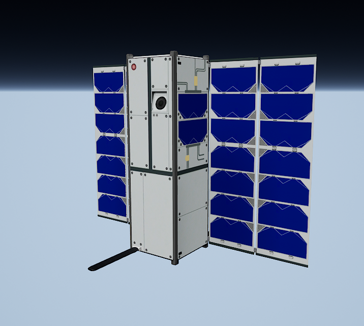

# FBX file of a CubeSat Mesh

  

An FBX file of a CubeSat which includes the mesh, textures, and skeletal mesh to animate the object used in 3D simulated environments.

## License
LICENSE NAME © 2022 The MathWorks, Inc.

## Community Support
[MATLAB Central](https://www.mathworks.com/matlabcentral)

Copyright 2022 The MathWorks, Inc.
